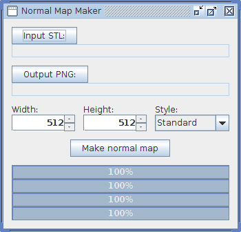
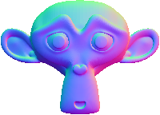
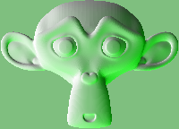

# NormalMapMaker

Turns [STL](https://en.wikipedia.org/wiki/STL_(file_format)) files into [normal map](https://en.wikipedia.org/wiki/Normal_mapping) images. It makes the normal map as a projection of the mesh on the **XY** plane, with **Z** pointing to the "camera". The STL file must have normal information. [Blender](https://en.wikipedia.org/wiki/Blender_(software)), for instance, doesn't save this information when exporting to STL. If the file contains more than one surface, only the first one is processed.

You can choose the maximum size of the output image. The mesh will be scaled, while keeping the aspect ratio, so most likely one dimension will be as chosen and the other will be smaller.

It can make maps in two different styles:

1. The style used in the link above: the **x** component of the normal vector is represented by the red color component, the **y** component by the green component and the **z** by the blue component. Here's Blender's Suzanne after being processed by this program:

2. The style used in [War Thunder](www.warthunder.com/)'s normal texture files: the **x** component of the normal vector is represented by the alpha color component, the **y** component is represented by the green component and the **z** component is not represented. Here's Suzanne with this style:

The **meshes** folder inside the **src** folder contains a test mesh. This program is capable of ignoring polygons that can't be processed to make a normal map, and this file contains one of each of these polygons. These polygons are considered invalid:

1. Polygons containing two or more vertices with the same coordinates.
2. Polygons with vertices in a line.
3. Polygons that look like a line in the **XY** projection.
